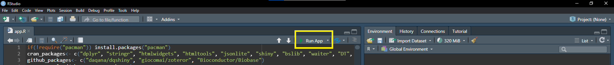
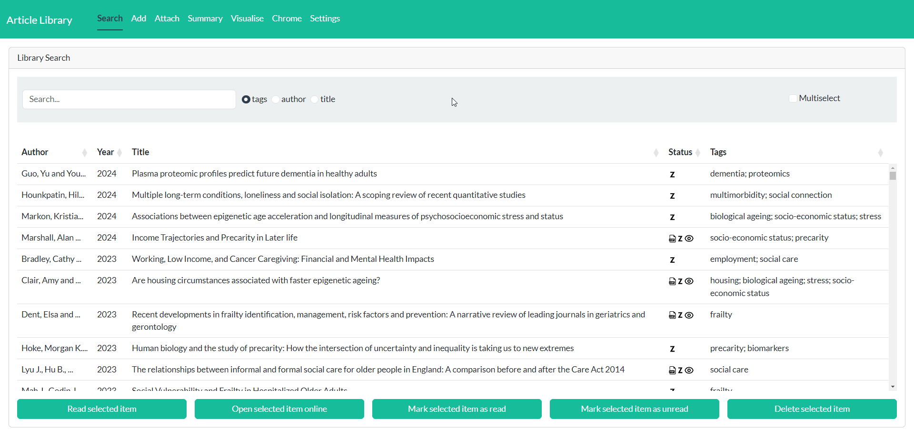
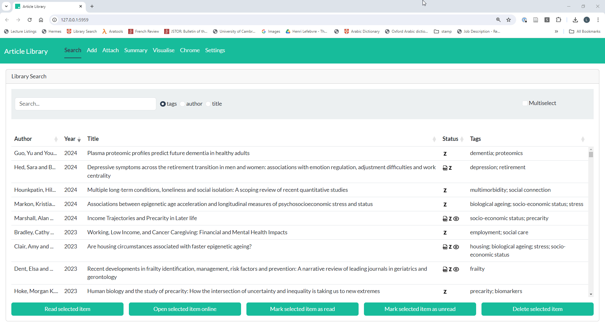

## Article Library ##

  

This is an R Shiny app for managing academic articles. It lets you add articles using a DOI, PDF or bib file and then tag the article with relevant themes. The app will then add the article to your Zotero account and store it in a searchable database. If you add a PDF, it will also save your PDFs in one place on your computer (sorted by year and author).

**This is a  work-in-progress that I am developing as I use it for my PhD. Bear in my that there are still various bugs...**

### Getting started ###

*Windows:*

1. This app is written in R, so you need to have it installed. If you don't have R, download and install it from [here](https://cran.rstudio.com/).
2. Make sure the path to R is added to your environment variable (instructions [here](https://info201.github.io/r-intro.html#:~:text=In%20Windows%2C%20You%20can%20add%20the%20R.exe%20and%20RScript.exe%20programs%20to%20your%20computer%E2%80%99s%20PATH%20by%20editing%20your%20machine%E2%80%99s%20Environment%20Variables%20through%20the%20Control%20Panel%3A)).
3. Shiny (a package in R) also needs to be installed before you can run the app. If you don't have it installed, open R or RStudio and enter `install.packages("shiny")` in the console and press enter. If you get an error when you do this, you may need to update your version of R.
4. Download/clone this repository. To download, click the green *Code* button above and click *Download ZIP*, then unpack the ZIP file.
5. Save the *Article Library* folder wherever you want to keep it. The app will store your article database and the PDFs within this folder.
6. To launch the app, run the *Article Library.bat* file and it should open in your default web browser. The first time you run the app, it may take a few minutes to open as it needs to install several R packages.
7. Once open, the app should detect that this is your first time running it, so will prompt you to complete some set-up steps.
8. To make it quicker to launch the app, you can create a desktop shortcut to the *Article Library.bat* file.

*Mac:*

1. This app is written in R and it is easiest to launch it from RStudio. You can download R and RStudio by following the instructions [here](https://posit.co/download/rstudio-desktop/).
2. Shiny (a package in R) also needs to be installed before you can run the app. If you don't have it installed, open R or RStudio and enter `install.packages("shiny")` in the console and press enter. If you get an error when you do this, you may need to update your version of R.
3. Download/clone this repository. To download, click the green 'Code' button above and click *Download ZIP*, then unpack the ZIP file.
4. Save the *Article Library* folder wherever you want to keep it. The app will store your article database and the PDFs within this folder.
5. Open RStudio and then open the *app.R* file that is in the *Article Library* folder.
6. Tell RStudio to launch Shiny apps in your default browser by clicking the arrow to the right of the *Run App* button (see image below) and selecting *Run External*.

  

7. Launch the app by clicking the *Run App* button. The first time you run the app, it may take a few minutes to launch as it needs to install several R packages.
8. Once open, the app should detect that this is your first time running it, so will prompt you to complete some set-up steps.

### Adding articles ###

To add an article, go to the *Add* tab. You can either upload the article's PDF, paste the DOI (or a web address containing the DOI) or upload a bib file. If uploading the PDF, there must be the DOI somewhere in the text. The app will then look up the details of the article and display them. Before you add the item to your library, you can then add tags to the article by scrolling down to the *Add tags* panel. Then click the green *Add items* button and the app will add the article to your library and to Zotero.

See below for a demo:

  

### Searching for articles ###

To search for an article you have in your library, on the main *Search* tab, simply use the search bar. This lets you search by article tag, author or title. To open the article as a PDF, first select the item by clicking on it, then click *Read selected item*. Alternatively, if you do not have the PDF for an article, to open it online click *Open selected item online*.

In this tab, you can also edit the tags associated with an article by simply double-clicking in the tags column and editing. Tags must be separated by a semi-colon. You can also mark an article as read/unread or delete it.

See below for a demo:

  

